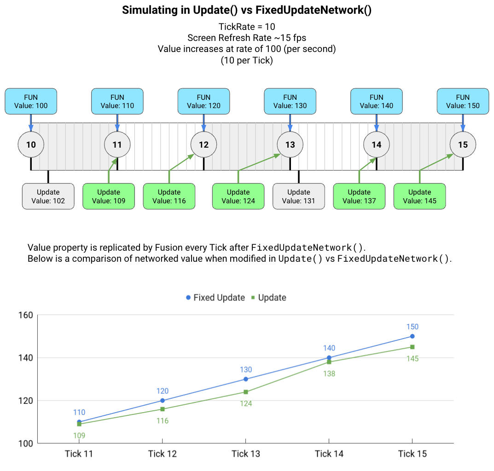
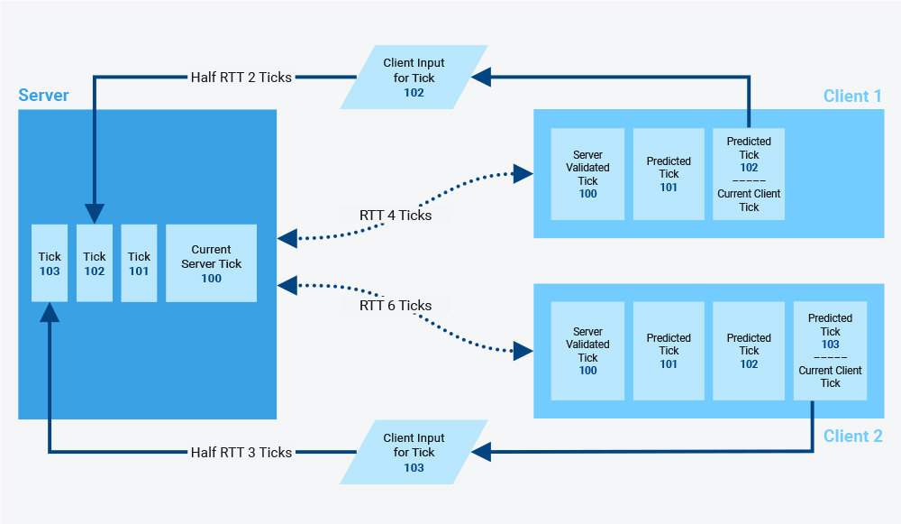
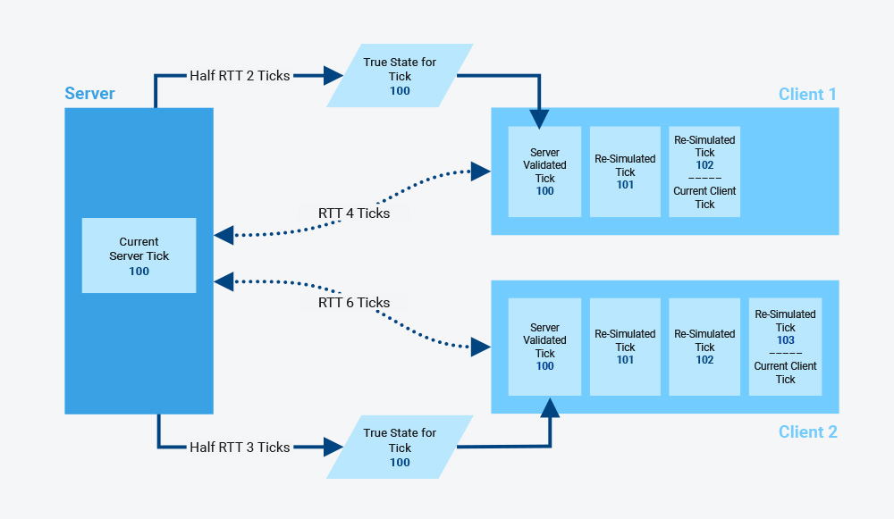

## 포톤 퓨전2 - 데디케이트 서버
해당 문서는 포톤 퓨전2 입문자를 위해 작성되었습니다.
필자 또한 입문자이며, 틀린 부분이 있을 수 있으니 감안하여 읽어주시길 바랍니다. 만약 피드백이 있다면 편하게 남겨주시면 감사하겠습니다.

## 시작하기
포톤 퓨전2는 총 3종류의 네트워크 토폴로지가 존재합니다.

클라이언트끼리 소통하는 Share 모드,   
클라이언트 한 명이 서버가 되어 호스트하는 Host 모드,   
마지막으로 서버가 벼래로 존재하는 Server 모드

로 나뉩니다.

해당 문서에서는 Server(+Host 모드)를 중심으로 설명합니다.

## 기본 행동강령
1. 스크립트가 부착되는 오브젝트와 그래픽으로 보여지는 오브젝트 분리하기   
네트워크에서 사용할 오브젝트를 생성할 시에는 최상위 부모로 빈 객체를 두고, 해당 오브젝트에 네트워크 스크립트 및 기타 스크립트를 모두 부착합니다. 그리고 해당 객체의 자식으로 그래픽 오브젝트를 둡니다.

## 포톤 퓨전 핵심

퓨전은 틱 기반 상태 동기화 라이브러리이다.
모든 클라이언트의 상태를 동기화 시키는 것을 목적으로 한다. 물론 상태 동기화 이외에도, 부드러운 시뮬레이션을 위한 기술(지연 보상, 예측)이나 상태 동기화와 무관한 네트워크 기능(RPC), 최적화를 위한 기술(관심 영역), 등 게임 서버 구축에 있어 다양한 기능을 지원한다.

### Tick(틱)


해당 사진은 공유 모드에서의 설명을 위한 사진이기 때문에 서버 모드에 맞지 않을 수 있다. 하지만 Tick이 어떻게 실행되는지 직관적으로 알 수 있어서 가져왔다.

틱이란, 서버에서의 일정한 시간 간격을 의미한다. 이 틱이 모여 네트워크 시뮬레이션 루프를 만들게 된다. 유니티의 FixedUpdate()의 시간 간격이 일정한 것과 유사하다고 생각하면 이해가 빠르다.

FixedUpdate()가 그렇듯 초당 프레임과는 별개의 개념으로 서버에서 서버만의 일정한 간격을 가진 시계를 만든다고 생각하면 간단하다.

퓨전에서는 틱을 이용한 시뮬레이션을 위해 FixedUpdateNetwork()라는 라이프 사이클을 제공한다. 앞서 말했듯, 틱을 이용한 시뮬레이션이기 때문에 FixedUpdate()와 유사하나 다른 점이 두 가지 있다.

1. 네트워크   
FixedUpdateNetwork()는 상태 동기화를 위해 만들어진 것이기 때문에 서버는 매 틱마다 네트워크로 클라이언트에게 현재 상태(스냅샷)를 복제해 상태를 동기화 시킨다.

2. 서버에서 틱을 재연산한다.   
예를 들어, 120번 틱까지 실행된 이후에 100번 틱부터 120번 틱까지 재연산한 결과를 바탕으로 121번 틱을 계산 후 시뮬레이션 할 수 있다는 것이다. 이렇게 틱을 재연산하는 이유는 네트워크 지연, 입력값, 등의 이유로 클라이언트들과 서버가 서로 다른 상태를 갖는 것을 최대한 막기 위함이다. 서버가 틱을 다시 계산해 동기화함으로 모든 클라이언트들이 일관성을 유지할 수 있게 된다.

### 네트워크의 상태

퓨전에서 말하는 네트워크의 상태는 일차원적으로 말해, 모든 네트워크 오브젝트의 네트워크화된 속성(네트워크에서 동기화하기로 결정한 변수)과 퓨전에서 제공하는 네트워크 동기화를 위한 스크립트들(간단한 예시로 NetworkTransform 이 있다. 해당 스크립트를 네트워크 오브젝트에 부착하면 해당 오브젝트의 Transform이 동기화된다. )을 말한다. 해당 값들을 동기화해 네트워크 상에서 모든 클라이언트의 일관성을 유지한다.

### [네트워크 시뮬레이션](https://doc.photonengine.com/ko-kr/fusion/current/concepts-and-patterns/network-simulation-loop)


사실 서버에서 매 틱마다 상태를 동기화 시키는 것만으로 모든 클라이언트가 동일한 시점에 동일한 상태를 갖는 것은 아니다. 서버와 클라이언트 사이에는 RTT(Round Trip Time)이 존재하고, RTT는 모든 클라이언트마다 상이할 수 있다. 위 그림의 Client 1을 예시로 하자면 서버와 클라이언트 사이에 왕복 4틱 차이가 있으므로 클라이언트에서 102번 틱을 수신했을 때 서버는 이미 104번 틱을 실행하고 있는 것이다.

포톤은 이 간극을 해소하고자 서버에서 수신받지 못한 상태(Tick)에 대해 클라이언트에서 예측을 진행하고, 복제와 조정을 통해 더욱 정밀한 예측을 할 수 있도록 구현되었다.

#### 예측
예측은 클라이언트가 자신의 입력을 바탕으로 미래 틱 상태를 예측하는 것이다. 물론 다른 클라이언트의 입력을 알 수 없기 때문에 이 예측은 틀릴 수 있다.



#### 복제
복제는 서버로부터 받은 스냅샷으로 예측 상태를 업데이트 하는 것을 목적으로 한다. 클라이언트는 이 스냅샷을 수신받은 뒤 더욱 정확한 예측을 위해 해당 스냅샷을 기점으로 이후 틱에 대한 재연산을 진행한다. 예를 들어, RTT가 2이고 서버로부터 100번 틱을 수신한 클라이언트는 현재까지 101번, 102번 틱을 예측해서 실행했을 것이다. 이제 100번 틱을 수신했으므로 101번, 102번 틱을 재연산하여 이후 틱을 더욱 정확하게 예측할 수 있도록 한다.

#### 조정
조정은 서버로부터 받은 스냅샷을 기반으로 현재 시뮬레이션을 정확하게 업데이트 하는 것을 목적으로 한다. 예측과 실제 시뮬레이션은 상이할 수 있으므로 조정을 통해 이를 동기화한다.

### 보간

Render() 은 FixedUpdateNetwork가 생성하는 Tick 사이를 보간하여 부드러운 렌더링을 보여준다. (Update()와 유사한 시점에 실행된다. )

#### +a

하지만 이러한 재연산은 UI와 같이 시뮬레이션과 무방한 부분에서는 필요하지 않다. 그래서 FixedUpdateNetwork에서 UI를 업데이트 할 시, Runner.IsResimulation을 체크해 재연산을 방지할 수 있다.

### 프라퍼티 상태 동기화(네트워크화된 속성)

해당 기능을 이용하면 스크립트 내 프라퍼티의 값을 모든 클라이언트에서 동기화시킬 수 있다.

* [Networked]   
이 애트리뷰트를 이용하면 NetworkTransform에서 Transform을 동기화시키듯 모든 클라이언트에서 프라퍼티 값을 일치시킬 수 있다. 이때 프라퍼티는 자동 생성된 프라퍼티({get;set;})여야 한다.

단, 권한이 없는 클라이언트가 변경할 시 다음 틱에 그 상태가 동기화 되어있던 값(이전에 서버에서 합의가 된 값)으로 덮어씌워진다.

물론 해당 기능은 스크립트가 부착된 오브젝트가 Spawn()된 이후에 사용할 수 있다.

* OnChangeRender(Action action)   
해당 함수는 [Networked, OnChangeRender(함수명)]과 같은 형태로 사용된다. 이러한 방식은 그래픽(UI 업데이트, 등)과 같이 실제 시뮬레이션과 관계없는 것들을 변경할 때 사용하면 유용하고, 만약 시뮬레이션과 관계 있는 것들을 변경하고자 할 때는 ChangeDetector을 사용하는 것이 좋다.

### RPC
일반 메소드에 대한 직관적인 매핑을 제공한다. 일반 메소드를 모든 클라이언트에서 실행하길 바랄 때 RPC를 사용할 수 있다.

서로 다른 클라이언트에서 서로 다른 시간에 실행된다. (특정 틱에 의존되어있지 않음) 수신받지 못했을 경우 그대로 해당 클라이언트에서는 작동하지 않게 된다.

즉, 틱에 의존하는 네트워크 시뮬레이션에 결합되어있지 않다. 시뮬레이션 로직에 사용하면 위험하다. 하지만 굳이 틱으로 정밀하게 관리할 필요가 없을 경우 유용하게 사용할 수 있다.

사용 예시
1. 플레이어 메시지 전송
2. 상점에서 구매
3. 플레이어 정보 입력

RPC는 각 플레이어에서 네트워크로 직접 보내는 것이기 때문에 Fusion 입력 처리를 사용할 필요가 없다. Input을 단순히 유니티 입력 처리 방식(로컬/Update(), 등)으로 해도 된다.

호스트 모드에서 Rpc는
클라이언트 -> 호스트
호스트 -> 모든 클라이언트
와 같이 두개의 RPC를 만들어야 한다.
* [관련 링크](https://doc.photonengine.com/ko-kr/fusion/current/tutorials/host-mode-basics/6-remote-procedure-calls)

## 퓨전의 주요 스크립트들

### [NetworkRunner](https://doc.photonengine.com/ko-kr/fusion/current/manual/network-runner)

퓨전 네트워킹의 기본 단위이다. 유니티 인스턴스 하나에 하나의 NetworkRunner만 존재하 수 있다. 일종의 네트워크 세션 개념이며, 세션이기 때문에 한 번 사용한 뒤 파기하고 다시 생성해야 한다.

즉, 게임 세션을 시작해 방을 생성/참여하고 플레이 할 수 있게 만든다. (=로비에서는 사용할 필요가 없다. 게임 세션 생성 시에 생성하면 된다! )

당연하지만 NetworkRunner가 없을 경우 모든 포톤 관련 콜백은 작동하지 않는다.

### [NetworkObject](https://doc-api.photonengine.com/en/fusion/current/class_fusion_1_1_network_object.html)

RPC, [Networked]와 같은 네트워크 동기화 기능을 사용하는 오브젝트를 위한 스크립트이다. 편의 상 해당 스크립트가 붙은 오브젝트를 네트워크 오브젝트라고 칭한다.

NetworkRunner가 관리하는 방 내의 단일 네트워크 오브젝트로, 모든 오브젝트에 ID가 부여된다. 모든 클라이언트는 동일한 오브젝트에 대해 동일한 ID를 갖고 있다.

네트워크 오브젝트를 생성하는 방법은 두가지이다.

1. Spawn()   
위 함수는 서버에서만 실행될 수 있고, 모든 클라이언트로 전파된다.
2. 네트워크 오브젝트가 있는 씬을 로딩   
씬 로드 시에 활성화 된 모든 네트워크 오브젝트가 서버에 연결되고, 이때 부여된 NetworkID가 모든 클라이언트로 전파된다.

네트워크 오브젝트 생성 시에는 어떤 방법을 사용하든 **연결(Attach)** 과정을 거치게 된다. NetworkID를 할당하고, 네트워크 처리를 위한 기본 세팅을 마친 뒤 모든 클라이언트에서 Spawn()을 진행한다. 이후 틱에서는 해당 오브젝트에 부착된 스크립트들의 시뮬레이션(FixedUpdateNetwork, Render) 및 네트워크 상태 동기화(네트워크화된 속성, RPC)가 실행된다.

네트워크 오브젝트가 생성된 이후에는 **NetworkBehaviour를 상속받은 스크립트를 추가하거나 제거할 수 없다.** 단, 런타임으로 스폰 전에 추가하는 것은 가능하다.

### [NetworkBehaviour](https://doc-api.photonengine.com/en/fusion/v2/class_fusion_1_1_network_behaviour.html)

NetworkBehaviour은 Fusion에 포함된 네트워크 기능들을 사용할 수 있도록 하는 클래스이다. MonoBehaviour의 퓨전 버전이라고 생각하면 편하다. 단, NetworkBehaviour을 상속받은 스크립트를 부착한 오브젝트는 반드시 NetworkObject를 부착해야 한다. (부모 오브젝트가 부착했을 경우 자식 오브젝트는 부착하지 않아도 된다. )

NetworkBehaviour에도 NetworkBehaviourID가 생성된다.

NetworkBehaviour을 상속받음으로 사용할 수 있는 기능들 : 
* Runner 프라퍼티
* Object 프라퍼티
* 네트워크화 된 속성, RPC
* 가상 이벤트 콜백(FixedUpdateNetwork, Spawn, 등)
* 권한 관리(HasInputAuthority)

NetworkBehaviour은 SimulationBehaviour을 상속받았고 SimulationBehaviour은 Behaviour(Fusion의 MonoBehaviour 대용 base 클래스.)를 상속 받았다.
테스트 결과 MonoBehaviour의 라이프 사이클을 정상적으로 사용할 수 있다.

NetworkBehaviour은 추가로 라이프 라이클을 4가지 갖고 있다.

1. FixedUpdateNetwork(FixedUpdate)
2. Spawn(Start)
3. Despawn(Destroy)
4. Render(Update)   
모든 시뮬레이션 step(FixedUpdateNetwork) 이후에 실행된다.

이외에도 다양한 인터페이스를 통해 다양한 타이밍 이벤트를 구현할 수 있다. (ex. IAfterSpawn(), 등)

### [SimulationBehaviour](https://doc-api.photonengine.com/en/fusion/v2/class_fusion_1_1_simulation_behaviour.html)

SimulationBehaviour은 시뮬레이션을 위해 사용된다. NetworkBehaviour이 네크워크 통신과 상태 동기화에 집중했다면 SimulationBehaviour은 시뮬레이션 로직에 집중한다. 물론 NetworkBehaviour은 SimulationBehaviour을 상속받아 해당 기능을 모두 사용할 수 있다.

네트워크화된 속성([Networked])와 RPC는 사용할 수 없다. 이러한 동기화는 NetworkBehaviour을 상속받아 사용하도록 하자.

사용할 수 있는 라이프 사이클과 프라퍼티는 다음과 같다.
* FixedUpdateNetwork()
* Render()
* Runner 프라퍼티
* Object 프라퍼티

### 제네릭

제네릭 클래스가 NetworkBehaviour 상속은 가능하나, 제네릭 변수에 [Networked]를 붙일 수는 없다.

### StateAuthority/InputAuthority 등 흐름 관리

기본적으로 특정 플레이어는 서버에 의해 스폰된다. 그리고 해당 플레이어의 라이프 사이클은 모든 클라이언트에 의해 동작한다. (모든 클라이언트에 해당 플레이어가 존재하기 때문. ) 따라서 InputAuthority에 의해 해당 플레이어에 입력 권한이 있는 사용자만 입력을 처리할 수 있게 해야 한다.

State Authority는 서버를 확인하기 위함.

즉, 전부 권한 확인을 위해서이다. 권한이 없는 곳에서 기능이 실행되지 않도록 확인할 수 있게 만들어준다.


## 포톤 퓨전 기타 기술

### NetworkButtons

버튼의 입력 상태 추적에 도움을 주는 Fusion 타입이다. 인풋 처리 시 사용할 수 있다. 지난 틱에 버튼이 눌렸는지 확인할 수 있다.
인풋 처리 시 사용.

### 연타 처리
Update()를 이용해 사전에 연타 기록을 받아두고 다음 틱에 보내는 방식도 가능하다.
(튜토리얼 - 예측 참고)

### Spawn()은 인스턴스 생성 이후 동기화 전 호출
이를 이용하여 Spawn에 콜백을 넣어 동기화 전에 함수가 호출되도록 할 수 있다. 일종의 Awake() 느낌.

### 메인 로직과 다른 부차적 로직(ex. 볼 발사 시 플레이어 색 변화) - ChangeDetector

ChangeDetector 는 네트워크화된 속성 값의 변경사항을 확인하는 용도로 사용된다.

foreach -> changeDetector.DetectChanges를 이용하면 네트워크 프라퍼티에서 발생한 모든 변경 사항을 반복한다. 여기서 원하는 네트워크 프라퍼티를 가져와 해당 프라퍼티에서 발생한 변경 사항으로 특정한 행동을 취할 수 있다.

다만, 속성 변화가 재연산에 의해 여러번 발생하거나 패킷 드롭으로 인해 발생하지 않을 수 있다.

변경되는 틱 직후에 실행된다.

### IBeforeUpdate/IAfterUpdate

유니티의 Update와 유사하게 사용할 수 있다. 이외에도 다양한 시점에 대한 인터페이스가 존재한다.

### 치팅 방지

무언가 값을 처리할 때 normalized를 이용하면 말도 안되는 광대한 값의 치팅을 방지할 수 있다.

### Runner.DeltaTime
서버 Tick 간 시간입니다.

### TickTimer
포톤 퓨전에서 제공하는 편리한 타이머입니다. (ex. Init에서 5초 설정 시 5초 후 FixedUpdateNetwork 등에서 Expried로 종료 시간을 확인할 수 있음. )   
시간 설정 및 Expired 확인은 Runner에 의존한다.

### KCC?

## 실제 개발 방식

### 인풋 처리

서버는 직전 Tick의 Input을 받아서 실행하고 다음 Tick을 생성한다.

포톤 퓨전의 인풋 처리 방식은 INetworkInput을 상속받은 구조체를 통해 수행된다. 일종의 패킷을 생성한다고 보면 이해가 쉽다. 이때, 다른 클라이언트에게는 해당 Input값이 넘어가지 않는다. 단지 서버가 해당 Input을 받아 처리한 뒤 그 상태를 다른 클라이언트에게 전파한다.

resetInput과 같은 bool 값을 만들어 인풋 변화를 체크할 수 있다. (Multi-Climb 예제 Part1)

GetInput은 StateAuthority/InputAuthority 모두 가져야 true를 반환한다.

* 인풋 수신 로직

```c#
private bool _mouseButton0;
private void Update()
{
  _mouseButton0 = _mouseButton0 | Input.GetMouseButton(0);
}

public void OnInput(NetworkRunner runner, NetworkInput input)
{
  var data = new NetworkInputData();

  if (Input.GetKey(KeyCode.W))
    data.direction += Vector3.forward;

  data.buttons.Set( NetworkInputData.MOUSEBUTTON0, _mouseButton0);
  _mouseButton0 = false;

  input.Set(data);
}
```

* 인풋 송신 로직
```c#
    if (GetInput<MyNetworkInput>(out var input))
    {
      if (input.DrinkPotion)
      {
        Health += 25;
      }
    }
```

### Network/Simulation/MonoBehaviour

* MonoBehaviour   
정말 로컬 컴퓨터에서만 돌아가면 될 때 사용한다. (Ex. 플레이어를 쫓아다니는 카메라) 당연하지만 여기서는 인가 관리를 할 필요가 없다. (로컬 클라이언트만 권한을 갖기 때문.)

* NetworkBehaviour   
RPC, 네트워크화된 속성, 등 퓨전의 네트워크 기능을 사용할 수 있게 된다. NetworkObject에서 사용할 수 있기 때문에 오브젝트가 네트워크에서 확실하게 관리될 필요가 있을 때 사용하면 된다. (Ex. 플레이어)   

* SimulationBehaviour & INetworkRunnerCallback 


    * SimulationBehaviour
    게임 오브젝트의 동작+네트워크 상태 동기화(네트워크화된 속성, RPC)와 관련된 코드는 필요 없지만 네트워크 시뮬레이션(FixedUpdateNetwork, Render)이 필요할 때 사용된다. (Ex. InputManager, 등)
    * INetworkRunnerCallback   
    NetworkRunner 기능에 자신이 원하는 추가 기능을 넣고 싶을 때 상속받아 구현한다. (ex. OnPlayerJoin 시에 커서가 사라지게 하고 싶을 경우)

### 인증/인가에 대하여(IsServer, HasAuthority)

서버/로컬 클라이언트/다른 클라이언트로 구분합니다. 로컬 클라이언트는 현재 내 컴퓨터로 처리됩니다.

* IsServer   
서버 컴퓨터에서만 실행되도록 한다.

* HasStateAuthority   
서버 모드에서는 서버만 권한을 갖는다. (테스트 안 해봄.)

* HasInputAuthority   
서버에서 스폰 시에 권한을 부여한 클라이언트(기본적으로 로컬)만 권한을 갖는다. 서버는 권한을 갖지 못한다.

### 서버만 생각해야 하는 부분에 대하여
네트워크화된 속성은 모든 클라이언트에게 상태로 공유된다. 하지만 서버만 알고 처리해도 괜찮은 것들이 존재하고, 이것은 공유될 필요가 없다. 이 경우 [Networked] 처리를 할 필요가 없다.

### 씬 관리

퓨전에서 제공하는 INetworkSceneManager 인터페이스 구현을 통해 씬 매니저를 손쉽게 구현할 수 있다. 아래 기능을 제공하고 있다. 

* 씬 로드/언로드   
서버에서만 수행할 수 있다.
* 추가 씬 로드   
등등...

### Spawn

네트워크 오브젝트 스폰 시에는 반드시 Runner.Spawn() 메소드를 사용한다.

Spawn()의 매개변수

* **[필수]** NetworkObject 타입의 프리팹(prefab)
* 위치(position)
* 회전(rotation)
* 입력 권한(input authority)를 식별하는 PlayerRef.
* 다른 인스턴스에서 객체를 복제하기 전에 실행할 NetworkRunner.OnBeforeSpawned 타입의 델리게이트

참고로 position을 변경해도 NetworkTransform 이 부착되어 있지 않으면 로컬에만 반영된다.

앞뒤전후로 다양한 콜백을 지원하니 참고하여 프로그래밍 할 것.

### PlayerRef

플레이어란, NetworkRunner가 붙은 모든 클라이언트를 의미한다.

PlayerRef는 클라이언트의 식별자이다. 허나 클라이언트의 특정 정보를 포함하지 않는다. 일종의 ID로 간주하면 된다.

네트워크 오브젝트에 PlayerRef를 NetworkRunner.SetPlayerObject(PlayerRef, NetworkObject) 함수로 부여할 수 있다.

#### PlayerCount
아래 config에서 전역적으로 설정 가능. 플레이어 수이기 때문에 전용 서버는 포함되지 않음.

### Network 환경 Config

아래 항목에 대한 설정을 제공한다. 현재 단계에서 볼 건 아닌 것 같고 좀 더 정밀하고 세밀한 조정이 필요한 경우에 보면 좋을 것 같다. (최적화, 등)

별 게 다 있다. (ex. 네트워크 프리팹 인스펙터, 등...)

* 버전(Version)
* 피어 모드(Peer Mode)   
Multiple로 설정 시, 빌드를 만들지 않고 에디터에서 여러개를 동시에 돌려 테스트할 수 있다.
* 기본 플레이어 수(Default Player Count): 기본적으로 허용되는 플레이어의 수 정의
* 네트워크 조건 테스트(Network Condition Testing): 네트워크 성능 및 조건을 테스트
* 암호화(Encryption): 데이터 전송의 보안을 위한 암호화 설정
* 프리팹 검사(Prefab Inspection): 네트워크에서 사용할 프리팹에 대한 검사 및 설정