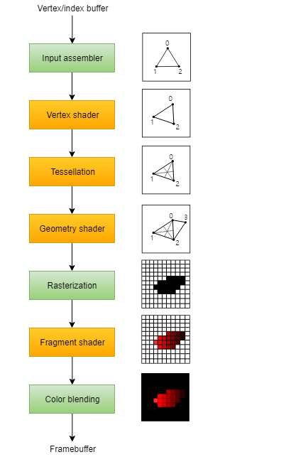
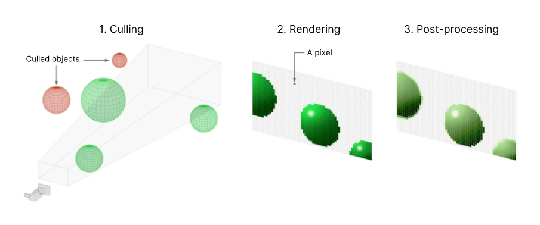
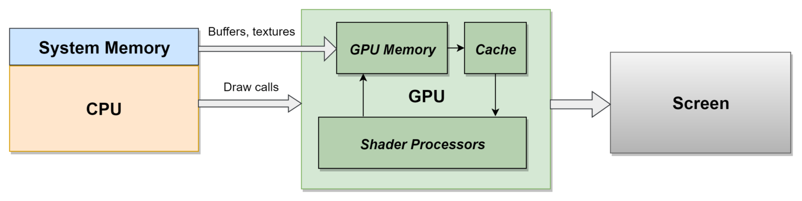
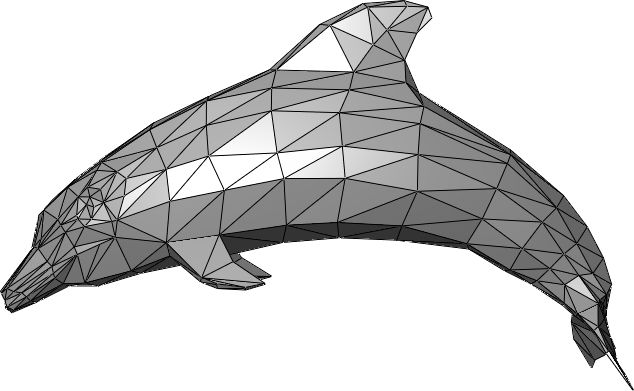
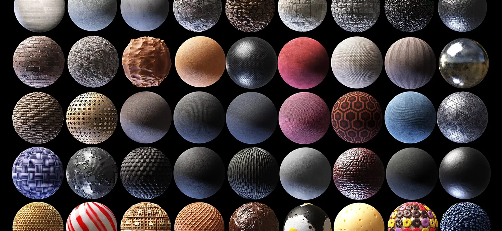
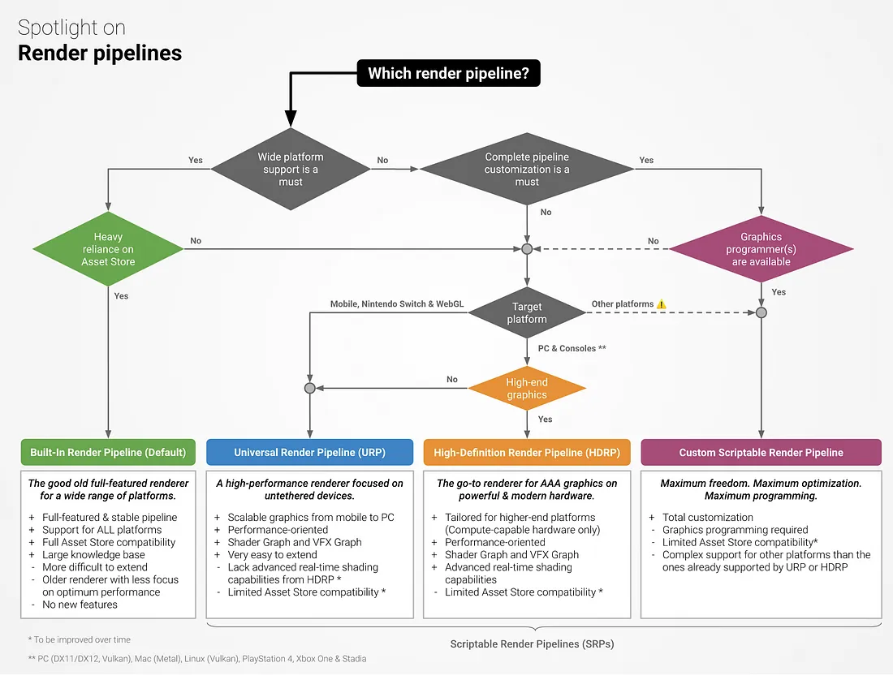

# Rendering

* Unity 씬에 놓인 오브젝트가 디바이스 화면에 그려지기까지의 연산 과정을 설명하세요.
  * [읽기 자료: 그래픽 렌더링 파이프라인](https://github.com/salt26/game-developer-interview?tab=readme-ov-file#%EA%B7%B8%EB%9E%98%ED%94%BD-%EB%A0%8C%EB%8D%94%EB%A7%81-%ED%8C%8C%EC%9D%B4%ED%94%84%EB%9D%BC%EC%9D%B8)에서
    제시하는 렌더링 과정 설명이 옳은 설명인지 검증하세요.

* 💯 드로우 콜이 무엇이고, 이것을 줄여야 하는 이유는 무엇인가요?

* 💯 드로우 콜을 최적화하려면 어떻게 해야 하나요?

* 🔨 Unity에서 Rendering Statistics 창을 켜 보고, `Batches`와 `SetPass calls`가 각각 의미하는 바가 무엇인지 설명하세요.

* 💯🔨 Unity에서 스프라이트 아틀라스를 사용하여 리소스를 묶는 실습을 진행하고 그 과정을 발표에서 보여주세요.
  * 이를 통해 Rendering Statistics 창의 `Batches` 수를 변화시키는 시나리오도 보여주면 좋습니다.

* 🔨 Unity에서 Frame Debugger를 실행하고 씬의 렌더링 과정(순서)을 한 단계씩 관찰하는 실습을 발표에서 보여주세요.

* 💯😎 과거에 진행한 프로젝트에서 텍스처 압축 방식은 어떤 것을 사용했나요?
  * 텍스처 압축 방식을 정할 때 어떤 점을 중요하게 고려해야 하나요?

* 😎🗽 어떤 이미지끼리 하나의 아틀라스로 묶는 것이 좋을지 논의해 보세요.

* 😎 UGUI의 Image 컴포넌트의 Source Image와 Sprite Renderer 컴포넌트의 Sprite를 None으로 두면 안 되는 이유를 설명하세요.

* 😎 Unity의 빌트인 셰이더가 어떤 상황에 어떻게 쓰이는지 알아보세요.
  * Unlit과 Lit 셰이더의 용도에 대해 알아보세요.
  * Mobile 셰이더를 언제 사용하는지 알아보세요.
  * UI 셰이더를 Sprite Renderer에서 사용하거나, 비 UI 셰이더를 Image에서 사용하면 어떤 문제가 발생하나요?

* 😎🔨 Vulkan과 OpenGL ES3에 대해 들어보셨나요?
  * URP를 사용할 때에는 어떤 것을 사용해야 하나요?
  * 갤럭시 S7보다 오래된 기기에서도 플레이할 수 있게 하려면 어떤 것을 사용해야 하나요?
  * Unity에서 Vulkan과 OpenGL ES3 중 하나만을 사용하도록 설정하는 방법을 발표에서 보여주세요.

## 렌더링 파이프라인

기본적인 렌더링 파이프라인 과정

1. Input assembler    
* 버퍼로부터 raw vertex data를 넘겨받는다.   
* 이 과정에서 인덱스 버퍼를 사용해 중복된 vertex data를 반복하지 않도록 할 수 있있다.   
* raw vertex data는 Premitive(로컬 좌표)에 대한 정보를 갖는다.

2. Vertex Shader

* raw vertex data에 transformation 연산을 적용해 Local Space를 최종적으로 Screen Space로 변환한다.
* Screen Space는 실제 화면 픽셀 좌표에 해당한다.
* (OpenGL 기준) View Space까지의 변환 과정이 Vertex Shader 과정
* Clip Space는 절두체를 이용한 Clipping 과정을 거친 뒤 3D 상태

3. Rasterization
* Premitive를 프레임 버퍼에 들어가는 픽셀 단위(Fragment)로 변환(보간 포함)
* Screen 밖의 Fragment는 discard
* Clip Space를 ViewScreen Space로 변환
    * 뷰포트 변환 : 3D -> 2D
    * 스캔 변환 : 2D -> Fragment
4. Fragment Shader 적용
    * 프레임 버퍼에 들어갈 모든 Fragment에 대해 color과 depth를 결정
5. 출력 병합
    * 최종적으로 그려질 픽셀을 정함

유니티 렌더링 파이프라인

1. 컬링
2. 렌더링
3. 포스트 프로세싱

> 내용 보충할 것

https://docs.unity3d.com/6000.0/Documentation/Manual/render-pipelines-overview.html
유니티 6 랜더링 파이프라인... 일단 이걸로 만족하자

## 드로우 콜?

그래픽스 API에 무엇을 그릴지, 어떻게 그릴지를 요청하는 것이다. (CPI -> GPU)  

한 번의 드로우 콜은 스크린에 그리는 과정에서 그래픽스 API에 전달해야 하는는 모든 정보를 담고 있다.
(ex. Texture, Shader, Buffer)

화면에 선별된 오브젝트를 출력하는 과정에서 발생한다. 

오브젝트를 렌더링하기 시작하면 GPU에 어떻게 렌더링 할지(어떤 Texture를 사용할지, 어떤 Mesh를 사용할지)를 전달해야 하는데,
이러한 정보를 담고 있는 테이블을 **렌더 상태(Render States)** 라고 한다.

CPU에서 GPU로 보내는 명령을 번역하는 과정도 존재. (코스트가 큼)

드로우 콜은 아래와 같은 정의를 순서를 갖는다.
1. 렌더 상태 변경 
2. 그래픽스 API에 그리기 요청    

### 드로우 콜 발생 조건

Mesh : 

Material : 

1 Mesh + 1 Material = 1 call
N Mesh + 1 Material = N call
1 Mesh + N Material = N call

이외에도 쉐이더, 등으로 인해 발생할 수 있음.

## 드로우 콜을 최적화 하는 방법

즉, 그리는 방법을 최적화하는 것이 아니기 때문에 드로우 콜을 발생시키는 횟수를 줄이는 것으로 드로우 콜을 최적화 할 수 있다.
아래는 드로우 콜을 발생시키는 횟수를 줄이는 방법들이다.

1. GPU Instancing
N Mesh + 1 Material = 1 call로 만드는 방법
나무와 같은 오브젝트에 자주 쓰인다.

-> 더 정확하고 깊은 정보를 전달드리기 위해 다음에 보충해오겠음

## Built-In VS URP

빌드인은 유니티에서 디폴트로 제공하는 파이프라인. 범용적.

URP는 Scriptable Render Pipeline, 즉, 사용자가 직접 렌더링 파이프라인을 구축할 수 있음.
다양한 플랫폼에서 최적화된 렌더링 파이프라인을 구축할 수 있음.
그럼에도 보편적 기능을 제공.

HDRP는 URP의 상위 호환으로, 더 무겁고 더 많고 사실적인 기능을 제공한다.

## Rendering Statistics & 스프라이트 아틀라스 실습

다음 시간에...

## URP에서 직접 렌더링 파이프라인 구축 실습

다음 시간에...

## 드로우 콜 최적화 실습